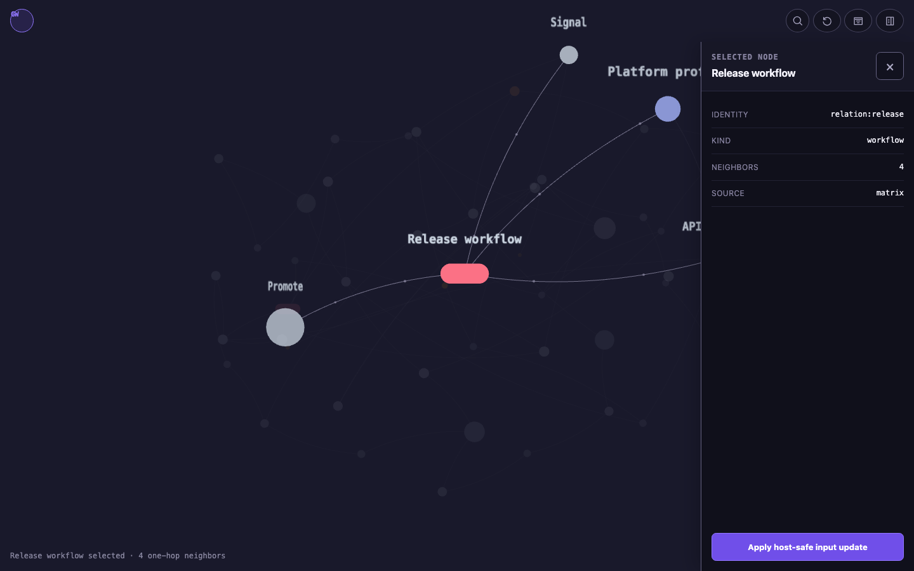
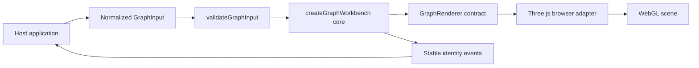

<div align="center">

<h1>graph-workbench</h1>

<p>
  정규화된 그래프 데이터를 선택 중심의 결정적 3D 작업대로 렌더링하는<br/>
  host-neutral TypeScript 라이브러리입니다.<br/><br/>
  파일, Tauri IPC, backend, domain semantics는 읽지 않으며 영속적인 domain state와<br/>
  사용자 action의 소유권은 host에 남깁니다.
</p>

<p>
  
  
  
  
</p>

<p>
  <a href="#빠른-시작">빠른 시작</a> ·
  <a href="#작동-구조">작동 구조</a> ·
  <a href="#공개-api">공개 API</a> ·
  <a href="#host-경계">Host 경계</a> ·
  <a href="#기여지원보안">기여·지원·보안</a>
</p>

</div>



위 화면은 repository의 sanitized browser fixture를 직접 실행해 캡처했습니다. 선택된 node,
1-hop 이웃, camera reframe, host-owned detail panel이 하나의 selection identity를 공유합니다.

## 핵심 가치

- **선택 중심 상호작용**: mouse, keyboard, programmatic selection이 같은 node identity와
  `onSelectionChange` 계약을 사용합니다.
- **결정적 layout**: `layout.seed`와 viewport에서 선택 node와 1-hop 이웃의 target을 계산하며
  원본 `GraphInput`을 mutate하지 않습니다.
- **Host-neutral core**: renderer-neutral core와 Three.js browser adapter가 분리되어 test host나
  custom renderer를 연결할 수 있습니다.
- **관찰 가능한 renderer**: selection, screen projection, transition, scene object, ambient motion을
  read-only observation으로 확인할 수 있습니다.
- **접근 가능한 motion**: light/dark presentation과 reduced motion을 지원하며 browser entry는
  `prefers-reduced-motion`을 자동 반영합니다.

## 빠른 시작

### 요구사항

- Node.js 20 이상
- Git client와 GitHub repository 접근
- ESM을 지원하는 TypeScript/JavaScript build 환경
- `/browser` entry 사용 시 WebGL을 지원하는 browser 또는 WebView

현재 package registry, tag, GitHub Release는 제공하지 않습니다. Git dependency를 immutable commit으로
고정해 설치하세요.

```sh
npm install git+https://github.com/pureliture/graph-workbench.git#1b4de61af13fdfdc513f5d153c94d050a0cb4726
```

설치 source는 Git이지만 import에는 repository의 package name인
`@pureliture/graph-workbench`를 사용합니다.

먼저 mount 대상에 실제 크기를 부여합니다.

```html
<div id="graph"></div>
```

```css
#graph {
  width: 100%;
  min-height: 32rem;
}
```

그다음 정규화된 `GraphInput`을 browser workbench에 전달합니다.

```ts
import type { GraphInput } from "@pureliture/graph-workbench";
import { createBrowserGraphWorkbench } from "@pureliture/graph-workbench/browser";

const input: GraphInput = {
  schemaVersion: 1,
  layout: { seed: "release-v1" },
  nodes: [
    {
      id: "workflow:release",
      type: "relation",
      kind: "workflow",
      label: "Release workflow",
      roles: ["master"],
    },
    {
      id: "component:api",
      type: "component",
      kind: "service",
      label: "API",
    },
  ],
  links: [
    {
      id: "workflow:release->component:api",
      source: "workflow:release",
      target: "component:api",
      relationKind: "workflow-step",
      occurrences: [{ ordinal: 0, id: "validate-api" }],
    },
  ],
};

const workbench = createBrowserGraphWorkbench({
  input,
  onSelectionChange: ({ node, neighborNodeIds, source }) => {
    console.log(node?.id, neighborNodeIds, source);
  },
  onRendererStateChange: ({ status, reason }) => {
    if (status === "failed") console.error(reason);
  },
});

const graph = document.querySelector<HTMLElement>("#graph");
if (!graph) throw new Error("#graph mount element is missing");

workbench.mount(graph);
workbench.fit(0); // 0 ms initial camera fit

export function destroyGraphWorkbench() {
  workbench.destroy();
}
```

SPA나 component framework에서는 component cleanup에서 `destroyGraphWorkbench()`를 호출하세요.
같은 instance를 나중에 다시 mount할 예정이면 `destroy()` 대신 `unmount()`를 사용합니다.
`onRendererStateChange`가 `failed`를 반환하면 host가 fallback UI를 표시해야 합니다.

외부 JSON처럼 type이 확인되지 않은 값은 runtime contract로 검증할 수 있습니다.

```ts
import { validateGraphInput } from "@pureliture/graph-workbench";

export function parseGraphInput(rawValue: unknown) {
  return validateGraphInput(rawValue);
}
```

검증 실패 시 `GraphInputValidationError`가 정확한 path별 issue를 포함해 throw됩니다.

## 작동 구조



| 계층 | 책임 |
|---|---|
| Host | graph 생성, domain semantics, selection persistence, detail UI, backend action |
| Core | input 검증, selection/layout 계산, presentation 정규화, stable event 전달 |
| Renderer contract | data·camera·observation을 host-provided renderer와 연결 |
| Browser adapter | Three.js와 `3d-force-graph`를 사용해 WebGL scene 렌더링 |

## `GraphInput` 계약

`GraphInput`은 TypeScript type과 `graphInputJsonSchema`/`validateGraphInput()` runtime contract를
함께 제공합니다.

| 필드 | 계약 |
|---|---|
| `schemaVersion` | 현재 `1` |
| `layout.seed` | 비어 있지 않은 deterministic layout seed |
| `nodes` | unique `id`와 `type`, `kind`, `label`을 가진 node 목록 |
| `nodes[].roles` | optional array; 현재 허용 role은 `master`뿐이며 전체 input에서 최대 하나만 지정 가능 |
| `links` | unique `id`, 존재하는 source/target, self-link 금지 |
| `links[].occurrences` | 하나의 bundled link에 보존할 ordered occurrence 목록 |
| `metadata` / `extensions` | core가 해석하지 않고 보존하는 host-owned 확장 데이터 |

`master`는 degree, 화면 위치, 크기로 추론되지 않습니다. master가 없는 input도 유효합니다.
자세한 schema와 validation rule은 [`src/contract.ts`](src/contract.ts)를 참고하세요.

## 선택과 표현

`selectNode()`가 programmatic selection의 canonical path입니다. Mouse click, keyboard navigation,
`selectNode()`는 같은 selected identity와 ordered 1-hop neighborhood를 만듭니다. `focusNode()`는
selection을 바꾸지 않는 camera-only compatibility method입니다.

```ts
workbench.selectNode("component:api", "matrix");

workbench.setPresentation({
  ambientMotion: true,
  theme: "dark",
  nodeDescriptors: {
    "component:api": { color: "#38bdf8", label: "Public API" },
  },
});

// 앱 설정이 reduced motion을 요청할 때만 사용합니다.
// workbench.setReducedMotion(true);
```

Mount된 container는 focus 가능해집니다. Arrow keys는 node selection을 이동하고, `Enter`는 현재 node의
click path를 실행하며, `Escape`는 selection을 해제합니다. Canvas 밖의 접근 가능한 detail/fallback UI는
host가 제공합니다.

선택 transition은 선택 node, 1-hop 이웃, 나머지 node의 renderer-local target을 같은 transaction에서
계산합니다. Built-in renderer는 구형 volumetric body, camera-facing label, depth-aware opacity,
focused edge flow를 제공하며, reduced motion에서는 같은 target에 즉시 도달합니다.

## 공개 API

### Entrypoint

| Import | 용도 | 주요 export |
|---|---|---|
| `@pureliture/graph-workbench` | renderer-neutral core, validation, test/custom host | `createGraphWorkbench`, `validateGraphInput`, types |
| `@pureliture/graph-workbench/browser` | browser/WebView Three.js renderer | `createBrowserGraphWorkbench`, `createThreeForceGraphRenderer`, default node/link factories |

### `GraphWorkbench`

| 범주 | API |
|---|---|
| Lifecycle | `mount`, `unmount`, `destroy` |
| Input/presentation | `setInput`, `setPresentation`, `setReducedMotion` |
| Selection | `selectNode`, `focusNode`, `getSelectionState` |
| Camera/layout | `resize`, `fit`, `zoom`, `restoreCamera` |
| Observation | `getNodeScreenPosition`, `getRenderObservation`, `getTransitionObservation`, `getAmbientMotionObservation` |

Host callback은 `onNodeClick`, `onNodeHover`, `onFocusChange`, `onSelectionChange`,
`onBackgroundClick`, `onRendererStateChange`입니다. Selection callback의 `node`는 renderer copy가
아니라 현재 input의 원본 node object입니다.

### Observation 범위

- `getSelectionState()`는 selected identity, ordered 1-hop IDs, viewport, settled target을 반환합니다.
- `getNodeScreenPosition()`은 현재 camera와 live node transform의 canvas-local projection을 반환합니다.
- `getTransitionObservation()`은 cancellable selection transition의 generation, progress, live coordinates,
  optional camera pose를 반환합니다.
- `getRenderObservation()`은 public scene에 연결된 current factory object와 material evidence를 반환합니다.
  실제 pixel visibility를 주장하지는 않습니다.
- `getAmbientMotionObservation()`은 deterministic anchor와 실제 rendered/world/screen position,
  lifecycle, focused link flow를 반환합니다.

Observation은 상태를 바꾸는 command가 아니라 호출 시점의 read-only evidence snapshot입니다.
Mount 전이나 해당 optional seam을 구현하지 않은 legacy/custom renderer에서는 `null`일 수 있습니다.
Observation type과 renderer compatibility contract는
[`src/renderer-contract.ts`](src/renderer-contract.ts)를 참고하세요.

## 검증과 개발

```sh
npm ci
npm run check
npm run demo
```

전체 browser fixture 검증은 별도 dependency 설치 후 실행합니다.
Package 자체는 Node.js 20 이상을 지원하지만, 현재 fixture toolchain은 Node.js 22.13 이상을 요구합니다.
`check:browser`는 `check`를 먼저 실행하므로 두 명령을 따로 반복할 필요는 없습니다.

```sh
npm --prefix sites/browser-fixture ci
npm run check:browser
```

| 검증 경로 | 증명 범위 |
|---|---|
| `npm run check` | TypeScript build와 core/unit contract |
| fixture lint·SSR checks | host fixture와 server-rendered shell |
| Playwright browser suite | 실제 WebGL canvas, selection, projection, motion, theme, failure path |

[`sites/browser-fixture`](sites/browser-fixture)는 sanitized example data만 사용하는 독립 host입니다.
Tauri나 production backend를 필요로 하지 않으며 production application qualification을 주장하지 않습니다.

## Host 경계

이 package가 담당하지 않는 영역은 의도적인 contract입니다.

- file discovery, graph 생성, source scanning을 수행하지 않습니다.
- Tauri command, host IPC, backend API를 호출하지 않습니다.
- domain-specific panel, fallback copy, action, collapse state를 소유하지 않습니다.
- host metadata를 해석해 node role이나 topology를 추론하지 않습니다.
- selection마다 graph를 재조회하거나 input object를 mutate하지 않습니다.

Host는 유효한 input과 presentation을 언제든 교체할 수 있고, selection event를 자체 reducer나
domain action으로 연결할 수 있습니다.

## 기여·지원·보안

- 재현 가능한 bug report와 기능 제안은 [GitHub Issues](https://github.com/pureliture/graph-workbench/issues)에
  남겨주세요. 환경, 최소 재현 절차, 기대 동작과 실제 동작을 함께 적으면 확인에 도움이 됩니다.
- 개발 환경과 pull request 기준은 [CONTRIBUTING.md](CONTRIBUTING.md)를 따릅니다.
- 취약점이나 민감한 정보가 포함된 문제는 공개 Issue에 세부 내용을 올리지 마세요.
  안전한 신고 절차는 [SECURITY.md](SECURITY.md)를 확인하세요.

이 프로젝트는 현재 실험적 `0.x` 단계이며 지원 응답 시간이나 호환성 SLA를 보장하지 않습니다.

## 배포 상태

| 항목 | 현재 기준 |
|---|---|
| 패키지 버전 | `0.1.0` |
| 검증한 source commit | `1b4de61af13fdfdc513f5d153c94d050a0cb4726` |
| 최근 로컬 검증 | 2026-08-02; `npm run check`, `npm run check:browser` |
| 배포 방식 | Git commit dependency; registry, tag, GitHub Release 없음 |
| 안정성 | Experimental `0.x`; `1.0.0` 전에는 public API가 변경될 수 있음 |

새 release surface가 생기기 전까지 moving branch 대신 위 immutable SHA를 사용하세요.
위 검증 기록은 해당 commit에 대한 local test snapshot이며 지속적인 public CI 보장을 의미하지 않습니다.

## License

MIT. 자세한 내용은 [LICENSE](LICENSE)를 참고하세요.
